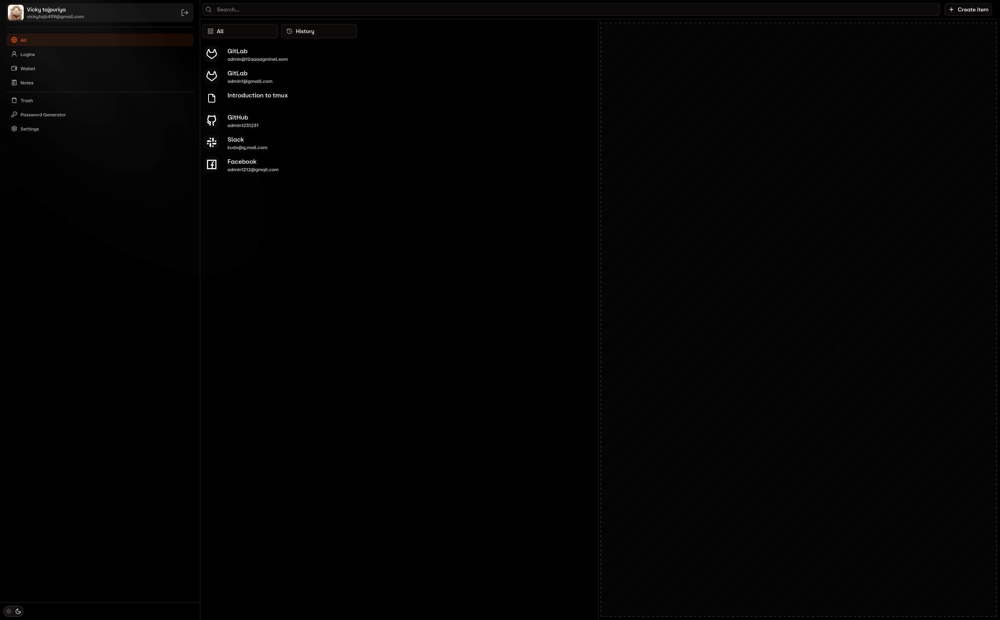

# Password Manager

Welcome to the **Password Manager** project! This application is a secure and robust password management tool built using **Next.js** for the frontend and **Django** for the backend. It leverages **RSA encryption** and multiple layers of security to ensure that your sensitive data is fully encrypted and stored in a highly secure environment. Users can also log in conveniently using their social accounts like **GitHub** or **Google**.

| Preview                                       |
| --------------------------------------------- |
|  |

---

## Features

### 🔒 **Advanced Security**
- **RSA Encryption**: All sensitive data is encrypted using RSA encryption, ensuring that your passwords are stored securely and are only accessible to you.
- **Multiple Layers of Security**: The application employs a combination of encryption, secure storage, and authentication mechanisms to protect your data.

### 🌐 **Modern Tech Stack**
- **Frontend**: Built with **Next.js**, providing a fast, responsive, and user-friendly interface.
- **Backend**: Powered by **Django**, a robust and secure backend framework.

### 🔑 **Authentication**
- **Social Login**: Users can log in using their **GitHub** or **Google** accounts for a seamless experience.
- **Authentication App**: Two-factor authentication (2FA) is integrated for an additional layer of security.

### 🛡️ **Vault**
- A secure vault where users can store and manage their passwords.
- Fully encrypted data storage ensures that even the developers cannot access your sensitive information.

## Author (Admin12121)
- LinkedIn: [in/vickytajpuriya](https://www.linkedin.com/in/vickytajpuriya/)